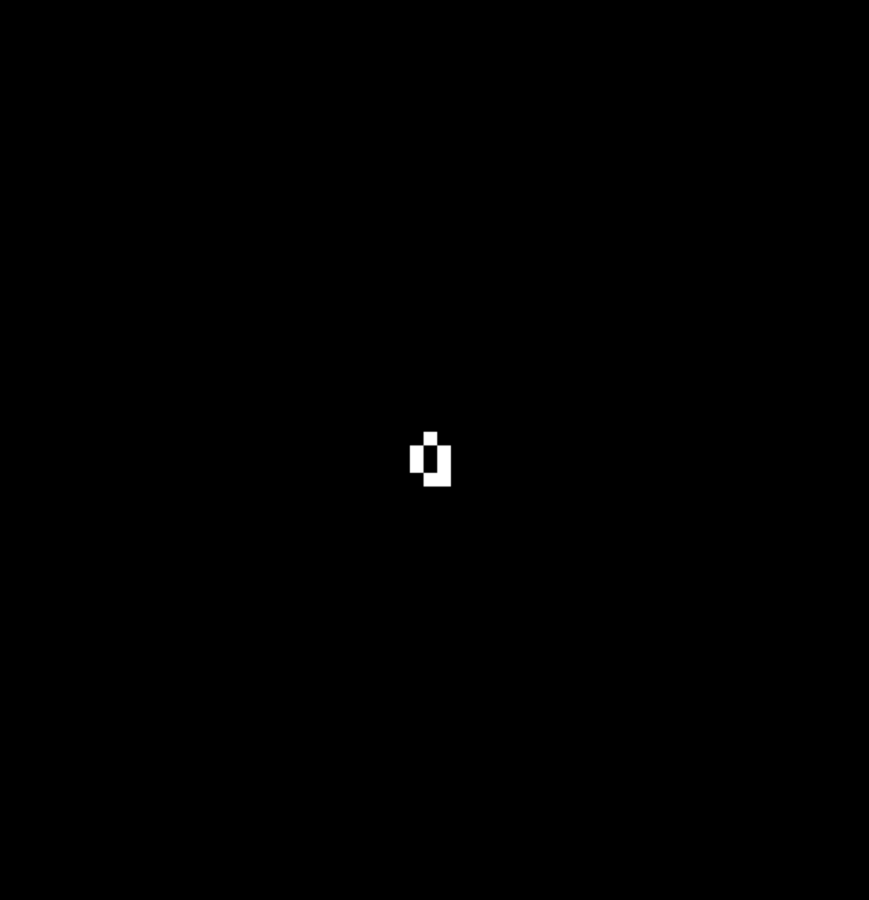

# Conway's Game of Life


## What is Conway's Game of Life
> The Game of Life, also known simply as Life, is a cellular automaton devised by the British mathematician John Horton Conway in 1970. It is a zero-player game, meaning that its evolution is determined by its initial state, requiring no further input.

<p align="center">

</p>

## To Play
```bash
git clone https://github.com/Zjjc123/game-of-life.git
cd game-of-life

python main.py
```
### Directions
``SPACE`` key to pause/play. When paused, left click to add cells 


## Found Patterns
> I can't guarantee that any of these has not been found before. But it's just cool to look at. I named them myself. Sorry if some oh-so-amazing mathematician named it before me. Apologies.

### Cocoon


### Vortex
